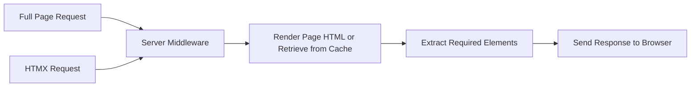

# Middleware

At the heart of AAXT is an [AdonisJS Middleware](https://docs.adonisjs.com/guides/basics/middleware) that does most of the heavy lifting. You can find the middleware in `/app/middleware/htmx_middleware`.

The process is something like this:

1. It intercepts a request and checks to see if you are making an HTMX request
2. If not, simply carry on and send the full page back (either from cache or by rendering the template)
3. If you are, extract out the target elements names from the request
4. If your request exists in cache, send that back
5. If not, wait for the fully rendered page and then extract out the elements that were originally requested and send them back

